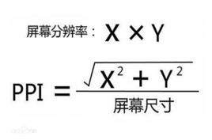

###  devicePixelRatio  
设备无关像素比。即物理像素与设备独立像素的比值，其中物理像素指的是屏幕的分辨率，是硬件层面上像素的计数。例如iphone 6的为 1334 * 750
通过window.devicePixelRatio可以访问到设备的dpr

###  device independent pixels  
设备独立像素。用于衡量元素大小的单位（类似于css？）,属于度量上的计数

###  pixels per inch    
每英寸像素数量。  